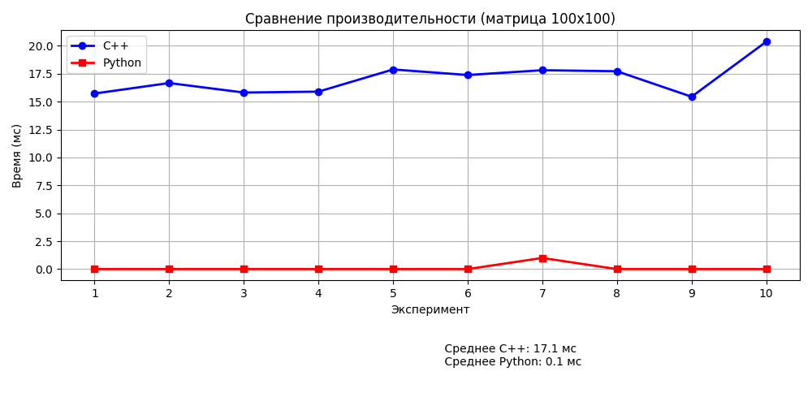

Написать программу на языке C/C++ для перемножения двух матриц. Исходные данные: файл(ы) содержащие значения исходных матриц. Выходные данные: файл со значениями результирующей матрицы, время выполнения, объем задачи. Обязательна автоматизированная верификация результатов вычислений с помощью сторонних библиотек или стороннего ПО (например на Matlab/Python).

Зависимость времени перемножения от размера матрицы: 

Программа корректно реализует перемножение матриц. Результаты совпадают с эталонными расчетами в Python (numpy). Производительность C++ реализации ожидаемо ниже оптимизированных библиотечных функций Python, что связано с использованием базовых алгоритмов без векторизации и аппаратных оптимизаций.