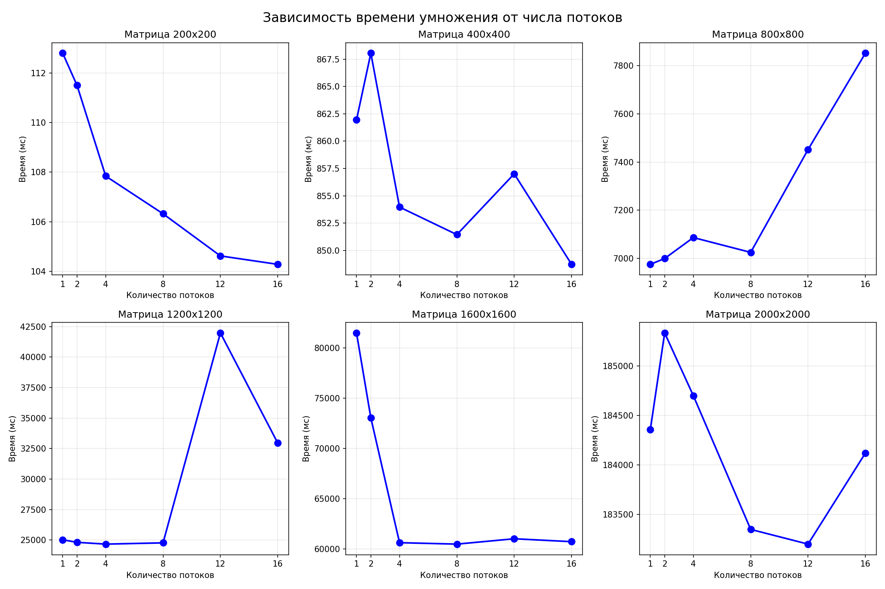
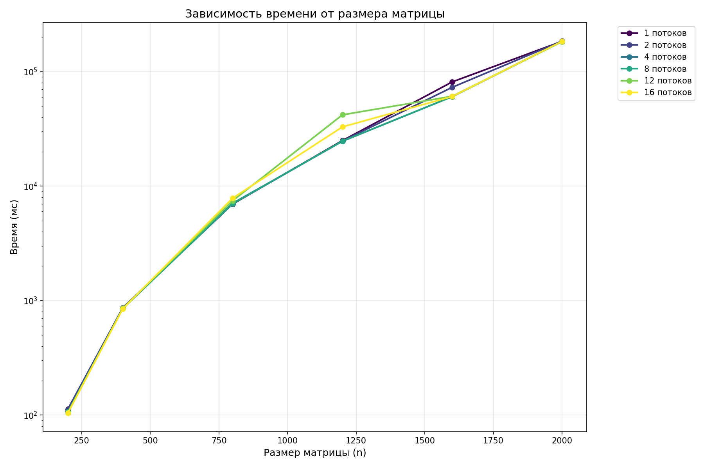
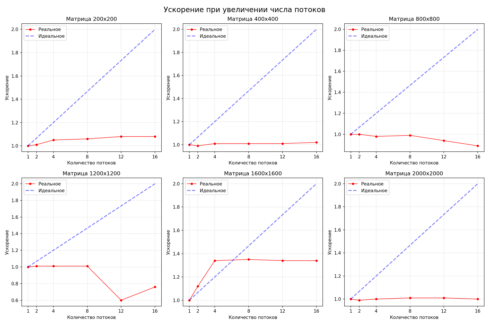

В ходе лабораторной работы было выпол нено параллельное умножение квадратных матриц с использованием технологии OpenMP. Были протестированы матрицы размером от 200×200 до 2000×2000 при количестве потоков от 1 до 16. В результате проведённых экспериментов были получены следующие зависимости.

Маленькие матрицы (200×200 – 400×400)

Ускорение практически отсутствует. Например, для матрицы 200×200 при увеличении числа потоков с 1 до 16 время выполнения сократилось незначительно: с 112.80 мс до 104.28 мс, что соответствует ускорению всего в 1.08 раза. 

Средние матрицы (800×800 – 1200×1200)

На матрице 800×800 при использовании 12 и 16 потоков наблюдается замедление: ускорение падает до 0.94x и 0.89x соответственно.

Крупные матрицы (1600×1600)

Для данного размера достигнуто наилучшее ускорение. При использовании 8 потоков время выполнения сократилось с 81 470 мс до 60 494 мс, что соответствует ускорению 1.35x.

Очень крупные матрицы (2000×2000)

Ускорение практически отсутствует. При увеличении числа потоков до 16 время выполнения остаётся на уровне ~184 000 мс, а ускорение не превышает 1.01x. Причина в том, что матрица такого размера уже не помещается в кэш-память L3. В таких условиях увеличение числа потоков не даёт выигрыша.

Ниже представлен графики вычислений

